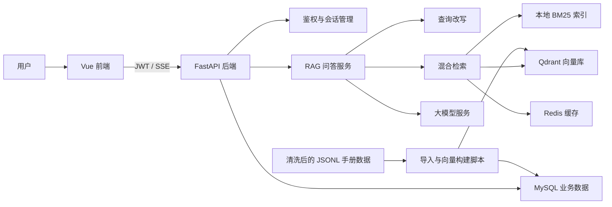

# 车型用户手册 RAG 智能问答系统

这是一个面向车辆用户手册场景的全栈 RAG 问答项目。系统将清洗后的车型手册切分为结构化 chunk，写入 MySQL，并通过 Qdrant 向量检索、本地 BM25 稀疏检索、RRF 融合排序和上下文扩展，为用户问题生成带引用来源的手册依据回答。

项目重点不只是“接一个大模型接口”，而是把登录鉴权、会话管理、流式问答、知识库导入、向量构建、混合检索、查询改写、缓存、日志和评估链路串成一个可运行的产品原型。

## 项目亮点

- 完整前后端闭环：Vue 3 前端聊天界面 + FastAPI 后端接口 + MySQL/Redis/Qdrant 基础设施。
- 强制走 RAG 链路：用户提问先检索车辆手册，再基于检索上下文生成答案，降低模型幻觉。
- 混合检索策略：向量召回结合本地 BM25 关键词召回，并使用 RRF 做结果融合。
- 查询理解增强：结合近期会话历史进行 query rewrite，支持多轮对话中的指代和上下文问题。
- 可追溯回答：返回答案时携带 chunk、来源文件、章节、页码和内容摘要，便于用户核验。
- 流式体验：后端通过 SSE 返回 `start`、`delta`、`done`、`error` 事件，前端实时渲染生成过程。
- 工程化数据链路：提供 JSONL 导入、embedding 构建、Qdrant upsert、RAG 评估脚本。
- 可观测与审计：保存消息、LLM 调用记录、RAG 检索结果、延迟和失败信息。

## 技术栈

| 模块 | 技术 |
| --- | --- |
| 前端 | Vue 3、TypeScript、Vite、Pinia、Vue Router |
| 后端 | FastAPI、SQLAlchemy Async、Pydantic Settings、Loguru |
| 数据库 | MySQL、Redis |
| 向量库 | Qdrant |
| 大模型 | OpenAI-compatible API，默认适配 DashScope |
| 检索 | Qdrant 向量检索、本地 BM25、RRF 融合、chunk 上下文扩展 |
| 数据处理 | JSONL chunk 导入、embedding 批处理、RAG 自动评估脚本 |

## 系统架构



## 核心问答流程

```text
用户提问
-> 保存用户消息
-> 结合历史会话改写查询
-> 向量检索 + BM25 关键词检索
-> RRF 融合排序
-> 扩展命中 chunk 的相邻上下文
-> 构建 RAG prompt
-> 调用大模型流式生成
-> 保存 assistant 答案和 RAG 查询日志
-> 返回答案与引用来源
```

## 功能模块

### 用户与会话

- 用户注册、登录、刷新 token、退出登录。
- JWT 鉴权保护 API。
- 创建、查询、重命名、删除会话。
- 保存用户消息和 assistant 回复。
- 支持会话摘要和近期历史，用于多轮 query rewrite。

### RAG 检索与生成

- 从 JSONL 文件导入手册 chunk 到 MySQL。
- 批量调用 embedding 服务，并写入 Qdrant。
- 支持按 `source_file` 限定车型手册范围。
- 支持向量检索、稀疏检索和 hybrid 检索策略。
- Redis 缓存 query embedding 与检索结果，减少重复调用成本。
- 返回引用来源，包括来源文件、章节标题、页码、chunk id 和内容摘要。

### 前端体验

- 登录、注册、聊天主界面。
- 会话列表与当前会话消息展示。
- 车型手册文档选择。
- SSE 流式输出，回答生成中实时追加文本。
- assistant 消息展示引用来源。

## 目录结构

```text
.
├── backend/                  # FastAPI 后端
│   ├── app/
│   │   ├── api/              # API 路由
│   │   ├── core/             # 配置、异常、日志、中间件、安全
│   │   ├── crud/             # 数据访问层
│   │   ├── db/               # MySQL / Redis 连接与初始化
│   │   ├── models/           # SQLAlchemy ORM 模型
│   │   ├── rag/              # 检索、prompt、向量库、本地稀疏索引
│   │   ├── schemas/          # Pydantic 请求响应模型
│   │   ├── scripts/          # 数据导入、embedding 构建、RAG 评估
│   │   └── services/         # 业务服务、LLM、embedding、聊天流
│   ├── pyproject.toml
│   └── README.md
├── frontend/                 # Vue 3 前端
│   ├── src/
│   │   ├── api/              # API client 与 SSE 解析
│   │   ├── components/       # 聊天窗口、输入框、消息列表、侧边栏
│   │   ├── router/           # 前端路由
│   │   ├── stores/           # Pinia 状态管理
│   │   └── views/            # 登录、注册、聊天页面
│   ├── package.json
│   └── README.md
├── data_clean/               # 数据清洗脚本、chunk 文件、评估结果
└── 需求/                     # 需求文档与项目笔记
```

## 快速启动

### 1. 启动依赖服务

本项目依赖 MySQL、Redis 和 Qdrant。默认配置见 `backend/app/core/config.py`：

- MySQL: `127.0.0.1:3306`
- Redis: `127.0.0.1:6379`
- Qdrant: `http://127.0.0.1:6333`

### 2. 配置后端环境变量

在 `backend/.env` 中配置数据库、Redis、Qdrant、LLM 和 embedding 服务。常用字段如下：

```env
MYSQL_HOST=127.0.0.1
MYSQL_PORT=3306
MYSQL_USER=root
MYSQL_PASSWORD=123456
MYSQL_DATABASE=car_manual_rag

REDIS_HOST=127.0.0.1
REDIS_PORT=6379

QDRANT_URL=http://127.0.0.1:6333
QDRANT_COLLECTION=car_manual_chunks

DASHSCOPE_API_KEY=your_api_key
LLM_MODEL=qwen3.6-flash-2026-04-16

EMBEDDING_BASE_URL=your_embedding_base_url
EMBEDDING_API_KEY=your_embedding_api_key
EMBEDDING_MODEL=your_embedding_model
EMBEDDING_DIM=1024
```

### 3. 启动后端

```bash
cd backend
uv sync
uv run uvicorn app.main:app --reload
```

后端地址：

- API: `http://127.0.0.1:8000`
- Swagger: `http://127.0.0.1:8000/docs`
- Health check: `http://127.0.0.1:8000/health`

### 4. 导入手册数据并构建向量

```bash
cd backend
uv run python -m app.scripts.import_chunks --file ../data_clean/chunks.jsonl
uv run python -m app.scripts.build_embeddings --batch-size 32
```

如果需要导入某个目录下的多个 JSONL 文件：

```bash
uv run python -m app.scripts.import_chunks --dir ../data_clean
```

### 5. 启动前端

```bash
cd frontend
npm install
npm run dev
```

前端地址：

```text
http://127.0.0.1:5173
```

## 主要 API

| 接口 | 说明 |
| --- | --- |
| `POST /api/v1/auth/register` | 用户注册 |
| `POST /api/v1/auth/login` | 用户登录 |
| `POST /api/v1/auth/refresh` | 刷新 token |
| `GET /api/v1/users/me` | 获取当前用户 |
| `GET /api/v1/conversations` | 获取会话列表 |
| `POST /api/v1/conversations` | 创建会话 |
| `GET /api/v1/conversations/{id}` | 获取会话详情和消息 |
| `PATCH /api/v1/conversations/{id}` | 重命名会话 |
| `DELETE /api/v1/conversations/{id}` | 删除会话 |
| `POST /api/v1/chat/stream` | RAG 流式问答 |
| `POST /api/v1/rag/search` | 手册 chunk 检索 |
| `GET /api/v1/rag/documents` | 获取已导入手册 |
| `GET /api/v1/rag/documents/{id}/chunks` | 查看手册 chunk |

## SSE 事件

`POST /api/v1/chat/stream` 使用 Server-Sent Events 返回生成过程：

| 事件 | 含义 |
| --- | --- |
| `start` | 用户消息已保存，返回 `conversation_id` 和 `user_message_id` |
| `delta` | 大模型生成的增量文本 |
| `done` | 生成完成，返回完整答案、引用来源和延迟 |
| `error` | 检索或生成失败 |

## RAG 评估

后端提供评估脚本，可基于标注集评估检索命中、页面召回、上下文相关性、答案质量等指标：

```bash
cd backend
uv run python -m app.scripts.evaluate_rag --eval-file ../data_clean/eval.jsonl --top-k 5
```

常用参数：

- `--limit N`：只跑前 N 条样本。
- `--generate-answers`：同时生成答案。
- `--llm-judge`：使用大模型评估答案正确性、忠实性和证据覆盖。
- `--no-source-filter`：评估时不按 `source_file` 限定手册。

## 展示

1. 打开前端，注册或登录用户。


2. 创建一个新会话，选择车型手册。


3. 提问一个车辆操作类问题，例如“怎么充电？”。


4. 展示回答下方的引用来源，说明答案如何回溯到手册页码和 chunk（包含车型、标题等）。


## 当前边界

- 当前知识库来源为预处理后的 JSONL 文件，暂不支持在线上传 PDF。
- 图片 OCR、多模态 RAG、Agent 工具调用暂未纳入主流程。
- 本项目是面试展示型工程原型，生产环境还需要补充迁移工具、权限细分、限流、监控告警和更完整的测试覆盖。
