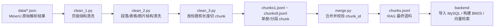

# data_clean 数据清洗流程复习笔记

这份笔记用于面试复习，依据 `data_clean` 目录下现有脚本和产物整理。整体目标是：把 MinerU/PDF OCR 解析出的复杂 JSON，清洗成后端 RAG 检索可以直接消费的 `chunks.jsonl`。

## 1. 总体链路



核心思路不是只做文本清洗，而是把 PDF 版式解析结果逐层变成“可追溯、可检索、可评估”的知识块。

## 2. 目录和文件职责

| 文件/目录 | 作用 |
| --- | --- |
| `data/*.json` | 原始输入，按车型和页码范围拆分：夏、唐、汉三套手册，每套分 3 段。 |
| `clean_1.py` | 页级清洗：保留 `page_idx`、推断真实页码 `page_number`、保留 `para_blocks`。 |
| `clean_2.py` | 段落级清洗：从 MinerU 的 `lines/spans/html` 中提取文本、表格、列表等内容；图片不进文本 RAG，另存 manifest。 |
| `clean_3.py` | RAG 切块：按标题组织上下文，控制 chunk 长度，生成 `chunk_id` 和 metadata。 |
| `merge.py` | 合并多个 `chunks*.jsonl`，按自然排序合并，并检查重复 `chunk_id`。 |
| `chunks1.jsonl` ~ `chunks9.jsonl` | 每个原始分段对应的 chunk 结果。 |
| `chunks.jsonl` | 最终合并后的 RAG 语料，当前共 1911 条 chunk。 |
| `eval_runs/` | RAG 检索和生成效果评估结果。 |

## 3. 输入数据

原始数据位于 `data_clean/data`：

| 原始文件 | 对应车型 | 页码范围 |
| --- | --- | --- |
| `夏1_180.json` | 夏 | 1-180 |
| `夏181_300.json` | 夏 | 181-300 |
| `夏301_464.json` | 夏 | 301-464 |
| `唐1_180.json` | 唐 | 1-180 |
| `唐181_300.json` | 唐 | 181-300 |
| `唐301_460.json` | 唐 | 301-460 |
| `汉1_170.json` | 汉 | 1-170 |
| `汉171_300.json` | 汉 | 171-300 |
| `汉301_412.json` | 汉 | 301-412 |

原始 JSON 的主结构是 `pdf_info`，每一页里包含：

- `page_idx`：当前文件内的页索引，通常从 0 开始。
- `para_blocks`：真正用于清洗的段落块，包含标题、正文、列表、表格、图片等。
- `preproc_blocks`、`discarded_blocks`、`page_size` 等版式/OCR 辅助信息，后续主链路基本不保留。

## 4. 第一步：clean_1.py 页级清洗

`clean_1.py` 的作用是先把原始 MinerU JSON 压成更稳定的页级结构。

主要处理：

1. 读取原始 `pdf_info`。
2. 跳过非字典类型的异常页对象。
3. 每页只保留：
   - `page_idx`
   - `page_number`
   - `para_blocks`
4. 通过参数 `--page-number-offset` 推断真实页码：

```text
page_number = page_idx + page_number_offset
```

例如处理 `夏181_300.json` 时，`page_idx=0` 应该对应真实页码 181，所以 offset 传 181。

示例命令：

```powershell
python .\clean_1.py data\夏1_180.json cleaned_1.json --page-number-offset 1
python .\clean_1.py data\夏181_300.json cleaned_1.json --page-number-offset 181
python .\clean_1.py data\夏301_464.json cleaned_1.json --page-number-offset 301
```

校验逻辑：

- 顶层必须有 `pdf_info`。
- `pdf_info` 不能为空。
- 每页必须有 `page_idx`、`page_number`、`para_blocks`。
- `None`、空字符串、空列表、空字典会被视为异常。

面试表达重点：这一步把“文件内页索引”和“真实手册页码”对齐，为后续检索命中页码、证据引用和评估指标打基础。

## 5. 第二步：clean_2.py 段落级清洗

`clean_2.py` 是清洗复杂度最高的一步，负责把 MinerU 的版式结构变成纯文本和结构化表格。

### 5.1 通用文本规范化

`normalize_text()` 做基础文本清洗：

- HTML 实体反转义。
- 全角空格 `\u3000` 转普通空格。
- 制表符、回车、换行压成空格。
- 连续多个空格压成一个。
- 去掉首尾空白。

### 5.2 正文和标题

对 `title`、`text` 这类块：

1. 遍历 `lines`。
2. 遍历每行的 `spans`。
3. 提取 span 中的 `content`。
4. 拼接成 block 级 `content`。
5. 保留 `type`、`level`、`index` 等少量结构字段。

清洗后形态类似：

```json
{
  "type": "title",
  "content": "1 安全",
  "level": 1,
  "index": 2
}
```

### 5.3 列表

对 `list` 块：

- 从子块中递归收集文本。
- 根据 `sub_type` 判断有序列表或无序列表。
- 生成 `items` 数组。
- 同时生成适合 RAG 的文本版 `content`。

这样做的好处是：既保留列表项结构，也让向量化时能直接吃到自然文本。

### 5.4 表格

表格是这个流程的亮点之一。脚本不是简单把 HTML 当文本拼进去，而是做了结构化解析：

1. 递归收集 `type=table` 且带 `html` 的片段。
2. 用 `HTMLParser` 解析 `<tr>`、`<td>`、`<th>`。
3. 读取 `rowspan`、`colspan`。
4. 展开跨行、跨列表格，尽量还原成矩形二维表。
5. 对前导上下文列做 forward-fill，避免分组列为空导致语义丢失。
6. 第一行作为表头，后续行转成 records。
7. 同时输出：
   - `content`：面向检索的文本描述。
   - `rows`：结构化行记录。
   - `markdown`：便于人工查看的 Markdown 表格。
   - `caption`：表格标题。

表格 chunk 后续可以被拆成多段，但每段仍保留 `rows` 和 `markdown`，这对排查检索效果很有用。

### 5.5 图片

当前文本 RAG 主链路会跳过纯图片块：

```text
if block_type == "image": return None
```

但脚本会额外生成 `image_manifest.json`，记录图片引用、页码、bbox、caption、footnote 等信息。这样设计的含义是：

- 当前问答先做文本 RAG，避免图片路径污染文本检索。
- 图片信息没有丢弃，未来可以扩展到多模态检索。

### 5.6 输出页结构

清洗后每页会形成：

```json
{
  "page_idx": 0,
  "page_number": 1,
  "para_blocks": [
    {"type": "title", "content": "..."},
    {"type": "text", "content": "..."},
    {"type": "table", "content": "...", "rows": [], "markdown": "..."}
  ],
  "page_content": "本页所有 block content 拼接结果"
}
```

校验逻辑：每个 `para_blocks` 元素必须是对象，并且 `content` 不能为空。

## 6. 第三步：clean_3.py RAG 切块

`clean_3.py` 把清洗后的页/段落结构变成最终 JSONL chunk。

关键参数：

```text
MIN_CHARS = 200
MAX_CHARS = 800
```

这里的长度不是原始字符串长度，而是去掉空白后的文本长度。

### 6.1 按标题构造文本 chunk

脚本按页面顺序遍历 `para_blocks`：

- 遇到 `title`：先 flush 当前文本块，再开启一个新的章节。
- 遇到 `text` 或 `list`：追加到当前章节。
- 遇到 `table`：先 flush 当前文本块，再单独生成表格 chunk。

这样做能让普通文本 chunk 尽量围绕一个标题组织，减少“一个 chunk 跨多个无关主题”的问题。

### 6.2 表格单独切块

表格不会和正文混在一起，而是单独作为 `chunk_type=table`。

处理规则：

- 如果表格内容不超过 800 字，整表作为一个 chunk。
- 如果表格太长，按行 records 分批，每批不超过 800 字左右。
- 每个表格 chunk 保留 `caption`、`rows`、`markdown`。

面试表达重点：表格单独切块能减少长表格挤压正文语义，同时保留结构化字段，后续可以做更精细的表格问答。

### 6.3 小块合并和长块拆分

脚本先合并过短文本块，再拆分过长文本块：

1. 非表格 chunk 如果少于 200 字，会尝试和后一个非表格 chunk 合并。
2. 合并循环执行，直到没有可合并的小块。
3. 非表格 chunk 如果超过 800 字，会按段落、换行、中文标点、空格递归拆分。
4. 如果仍然过长，最后硬切分。

这套规则是在“语义完整”和“检索粒度”之间折中：

- 太短：向量语义不足，检索容易漂。
- 太长：embedding 表达变稀释，召回后给 LLM 的上下文噪声变多。

### 6.4 chunk 字段

最终每条 JSONL 的核心字段：

| 字段 | 含义 |
| --- | --- |
| `chunk_id` | 唯一 ID，例如 `xia_p1_c001`。 |
| `source_file` | 来源手册，例如 `xia.pdf`、`tang.pdf`、`han.pdf`。 |
| `page_idx_start` / `page_idx_end` | 在当前输入文件内的页索引范围。 |
| `page_number_start` / `page_number_end` | 真实手册页码范围。 |
| `chunk_type` | `text` 或 `table`。 |
| `section_title` | 当前章节标题。 |
| `content` | 用于 embedding、BM25 和 LLM 上下文的文本。 |
| `metadata` | 下游检索需要的元数据副本。 |
| `rows` / `markdown` / `caption` | 表格 chunk 可能额外携带。 |

`chunk_id` 生成规则：

```text
{source_id}_p{page_number_start}_c{序号}
```

例如：

```text
xia_p1_c001
tang_p181_c001
han_p301_c001
```

## 7. 第四步：merge.py 合并产物

`merge.py` 负责把多个分段 chunk 合并成最终文件。

默认参数：

```powershell
python .\merge.py --input-dir . --pattern "chunks*.jsonl" --output-path chunks.jsonl
```

主要机制：

1. 用自然排序处理文件名，避免 `chunks10` 排在 `chunks2` 前面。
2. 自动排除输出文件本身，避免把旧的 `chunks.jsonl` 又合并进去。
3. 逐行 `json.loads` 校验 JSONL。
4. 默认发现重复 `chunk_id` 直接报错。
5. 先写临时文件，再 replace 成目标文件，减少写一半失败导致产物损坏的风险。

如果确实允许重复 ID，可以加：

```powershell
python .\merge.py --allow-duplicate-chunk-id
```

但一般不建议，因为 `chunk_id` 在后端数据库里是唯一键，也是评估和引用证据的锚点。

## 8. 当前产物统计

当前 `data_clean` 下的 JSONL 产物如下：

| 文件 | source_file | 页码范围 | chunk 数 |
| --- | --- | --- | --- |
| `chunks1.jsonl` | `xia.pdf` | 1-180 | 230 |
| `chunks2.jsonl` | `xia.pdf` | 181-300 | 211 |
| `chunks3.jsonl` | `xia.pdf` | 301-464 | 223 |
| `chunks4.jsonl` | `tang.pdf` | 1-180 | 230 |
| `chunks5.jsonl` | `tang.pdf` | 181-300 | 213 |
| `chunks6.jsonl` | `tang.pdf` | 301-460 | 218 |
| `chunks7.jsonl` | `han.pdf` | 1-170 | 208 |
| `chunks8.jsonl` | `han.pdf` | 171-300 | 224 |
| `chunks9.jsonl` | `han.pdf` | 301-412 | 154 |
| `chunks.jsonl` | 全部 | 合并结果 | 1911 |

已用 Python `json.loads` 校验过，当前这些 JSONL 文件均可正常逐行解析。

## 9. 和后端 RAG 的衔接

最终文件 `data_clean/chunks.jsonl` 会被后端使用：

- `backend/app/core/config.py` 默认配置：

```text
RAG_CHUNKS_JSONL_PATH = BASE_DIR.parent / "data_clean" / "chunks.jsonl"
```

- `backend/app/rag/importer.py` 导入 MySQL 时要求每条 chunk 至少有：

```text
chunk_id, source_file, content, chunk_type
```

- 导入命令示例：

```powershell
cd ..\backend
uv run python -m app.scripts.import_chunks --file ..\data_clean\chunks.jsonl
```

导入逻辑会：

1. 按 `source_file` 创建或复用 `ManualDocument`。
2. 按 `chunk_id` 创建或更新 `ManualChunk`。
3. 用 `content_hash` 判断内容是否变化。
4. 新增或更新后把 embedding 状态标记为 `pending`，等待后续向量化。

另外，`backend/app/rag/sparse_index.py` 会直接从 `chunks.jsonl` 构建 BM25 稀疏索引，并支持：

- 中文单字 token。
- 中文 bigram。
- 英文/数字 token。
- 按 `source_file` 过滤。
- 按 `chunk_id` 找前后邻居，做上下文扩展。

### 9.1 倒排索引是怎么构建的

`sparse_index.py` 里的 `SparseChunkIndex` 会在服务启动或第一次检索时读取 `chunks.jsonl`，然后在内存里构建关键词检索需要的倒排索引。

构建过程可以按 8 步理解：

1. 读取 `chunks.jsonl`，每一行是一条 chunk。
2. 每条 chunk 转成 `ChunkRecord`。
3. 保留 `chunk_id`、`source_file`、`section_title`、页码、`chunk_type`、`content`。
4. 把 `section_title + content` 作为关键词检索文本。
5. 对文本做轻量分词：中文单字、中文 bigram、英文/数字 token。
6. 对每个 chunk 用 `Counter` 统计 token 词频。
7. 建立 `token -> [(doc_index, term_freq), ...]` 的倒排索引。
8. 统计 `doc_freq`、`doc_lengths`、`avg_doc_length`，供 BM25 打分使用。

其中最核心的数据结构是：

```python
inverted_index: dict[str, list[tuple[int, int]]]
```

含义是：

```text
token -> [(chunk 在 records 里的位置, 这个 token 在该 chunk 里出现的次数)]
```

例如：

```python
{
  "制动": [(12, 2), (37, 1), (98, 3)],
  "摩擦": [(12, 1), (98, 1)],
  "20000km": [(12, 1), (45, 1)]
}
```

解释：

```text
"制动" 出现在第 12、37、98 个 chunk 中。
在第 12 个 chunk 中出现 2 次。
在第 37 个 chunk 中出现 1 次。
在第 98 个 chunk 中出现 3 次。
```

查询时，如果用户搜：

```text
制动摩擦块 20000km
```

系统会先把 query 分词，然后去 `inverted_index` 里找这些 token 出现在哪些 chunk 中，再对候选 chunk 计算 BM25 分数。

### 9.2 BM25 公式和含义

BM25 用来衡量某个 chunk 和 query 的关键词匹配程度。项目里的实现使用标准 BM25 思路，核心公式可以写成：

```text
score(D, Q) = Σ IDF(qi) * ( f(qi, D) * (k1 + 1) )
              / ( f(qi, D) + k1 * (1 - b + b * |D| / avgdl) )
```

其中：

| 符号 | 含义 |
| --- | --- |
| `Q` | 用户 query 分词后的 token 集合。 |
| `D` | 某个候选 chunk。 |
| `qi` | query 里的某个 token。 |
| `f(qi, D)` | `qi` 在 chunk `D` 中出现的次数。 |
| `|D|` | 当前 chunk 的 token 总数。 |
| `avgdl` | 所有 chunk 的平均 token 长度。 |
| `k1` | 控制词频增长收益，当前代码里是 `1.5`。 |
| `b` | 控制文档长度惩罚，当前代码里是 `0.75`。 |
| `IDF(qi)` | token 的稀有度，越少见权重越高。 |

项目中 IDF 的计算方式是：

```text
IDF(qi) = log(1 + (N - df(qi) + 0.5) / (df(qi) + 0.5))
```

其中：

| 符号 | 含义 |
| --- | --- |
| `N` | 总 chunk 数。 |
| `df(qi)` | 包含 token `qi` 的 chunk 数。 |

直观理解：

```text
1. 查询词在 chunk 中出现越多，分数越高。
2. 查询词越少见，区分度越强，分数越高。
3. chunk 太长时，会有长度惩罚，避免长文本因为词多而天然占优。
```

例如用户搜：

```text
制动摩擦块 保养项目 20000km
```

有两个候选 chunk：

```text
chunk_A:
保养项目：检查制动摩擦块和制动盘
保养时间和里程间隔：首保后每12个月或20000km

chunk_B:
保养项目：检查冷却水管有无损伤
保养时间和里程间隔：首保后每12个月或20000km
```

两个 chunk 都命中了 `保养项目` 和 `20000km`，但 `chunk_A` 额外命中了 `制动摩擦块`，所以它的 BM25 分数通常会高于 `chunk_B`。

面试时可以这样讲：

> 我们会从 `chunks.jsonl` 读取所有 chunk，把每个 chunk 的标题和正文拼起来分词，然后构建 `token -> chunk位置和词频` 的倒排索引。查询时同样分词，通过倒排索引找到候选 chunk，再用 BM25 打分。BM25 会综合考虑词频、词的稀有度和 chunk 长度：命中词越多、词越稀有，分数越高；chunk 太长会被长度归一化惩罚。这样可以补足向量检索对精确术语、数字、保养里程、按钮名等内容召回不稳定的问题。

所以 `chunks.jsonl` 同时服务于：

- MySQL chunk 管理。
- 向量库入库。
- BM25 稀疏检索。
- RAG 上下文邻居扩展。
- 评估时的 gold chunk 对齐。

## 10. 评估结果概览

`eval_runs` 下有检索和 LLM judge 评估结果。当前检索评估示例：

```json
{
  "total": 53,
  "successful": 53,
  "failed": 0,
  "top_k": 5,
  "retrieval": {
    "chunk_hit_rate": 0.9623,
    "chunk_recall": 0.8962,
    "mrr": 0.9403,
    "page_hit_rate": 0.9811,
    "context_recall": 0.8856,
    "context_precision": 0.9691
  }
}
```

开启 query rewrite 后的一份 summary 显示：

```json
{
  "use_query_rewrite": true,
  "final_seed_top_k": 10,
  "retrieval": {
    "chunk_hit_rate": 0.9811,
    "chunk_recall": 0.9497,
    "page_hit_rate": 1.0,
    "context_recall": 0.9724,
    "context_precision": 0.9969
  }
}
```

面试表达重点：清洗不是孤立工作，最终要用检索评估指标验证 chunk 粒度、字段设计和上下文扩展是否真的提升 RAG 效果。

## 11. 面试时可以这样讲

可以按这段话组织：

> 我负责的数据清洗链路是把 PDF/OCR 工具输出的复杂版式 JSON，处理成 RAG 可以直接消费的 JSONL。第一步做页级标准化，保留页索引并根据分段文件的 offset 推断真实页码，保证后续证据可追溯。第二步做段落级清洗，从 MinerU 的 lines/spans 中抽取标题、正文、列表文本，对表格用 HTMLParser 解析并展开 rowspan/colspan，保留 rows 和 markdown；图片不进入文本 RAG，但会输出 manifest 方便后续多模态扩展。第三步按标题组织语义 chunk，表格单独切块，并用 200 到 800 字的长度规则合并过短块、拆分过长块。最后把 9 个分段 JSONL 合并成统一的 chunks.jsonl，并检查 JSON 格式和 chunk_id 唯一性。这个文件既用于 MySQL 导入和向量化，也用于 BM25 稀疏检索、邻居扩展和评估。

如果被追问“为什么这样切块”，可以答：

> 主要是平衡召回率和上下文噪声。过短 chunk 语义不足，过长 chunk 会稀释 embedding 表达。按标题聚合可以保证语义边界，表格单独切块可以避免结构化信息被普通正文打散，同时保留 rows/markdown 方便后续精确问答和排查。

如果被追问“如何保证质量”，可以答：

> 清洗阶段有字段非空校验，合并阶段有逐行 JSON 校验和 chunk_id 去重。下游还有检索评估，关注 chunk_hit_rate、chunk_recall、MRR、page_hit_rate、context_recall、context_precision 等指标，用真实问答 case 验证清洗和切块质量。

## 12. 风险点和可优化方向

当前流程已经能支撑 RAG，但还有几个可以主动提的改进点：

1. 中文内容存在乱码现象。脚本当前主要解决结构清洗，没有做字符编码修复；如果要提升答案可读性，需要在源头 OCR/编码或清洗后文本层增加纠乱码策略。
2. `clean_1 -> clean_2 -> clean_3` 目前更像脚本串联，建议后续补一个 pipeline runner，一次性处理 9 个源文件并记录中间产物路径。
3. 表格解析已经保留 `rows`，后续可以针对表格问答做专门召回或结构化查询。
4. 图片 manifest 已经保留，但当前主链路没做多模态检索，未来可接入图片 caption 或视觉 embedding。
5. 长文本切分规则可以进一步结合标题层级、页眉页脚识别、车辆功能模块边界来优化。
6. 可以增加自动化测试：构造包含标题、正文、列表、rowspan/colspan 表格、图片块的最小样例，分别验证三个清洗阶段输出。

## 13. 快速复习关键词

- MinerU 原始 JSON
- `pdf_info`
- `page_idx` 与 `page_number`
- `page_number_offset`
- `para_blocks`
- `lines/spans/content`
- 文本规范化
- 表格 HTML 解析
- `rowspan` / `colspan`
- 图片 manifest
- 按标题聚合 chunk
- `MIN_CHARS=200`
- `MAX_CHARS=800`
- `chunk_id`
- `source_file`
- `metadata`
- JSONL
- chunk 去重
- MySQL 导入
- embedding pending
- BM25 稀疏索引
- 邻居上下文扩展
- chunk hit rate / recall / MRR / context recall
